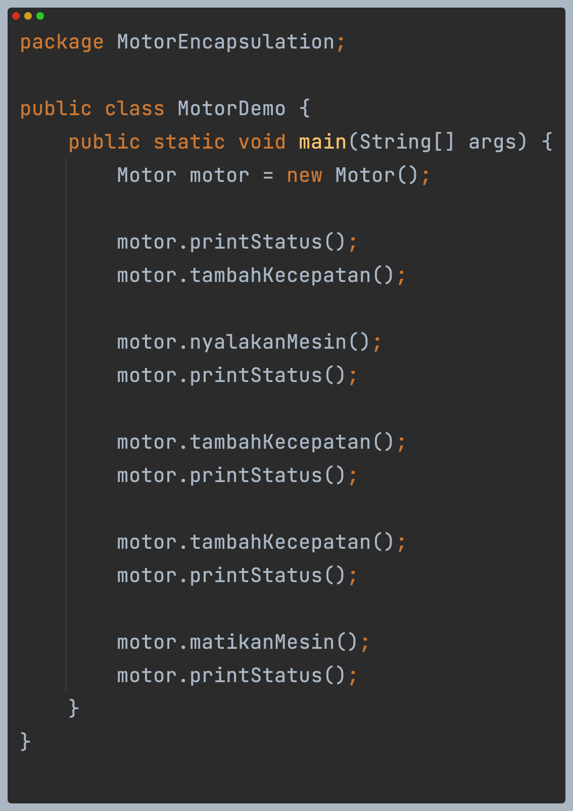
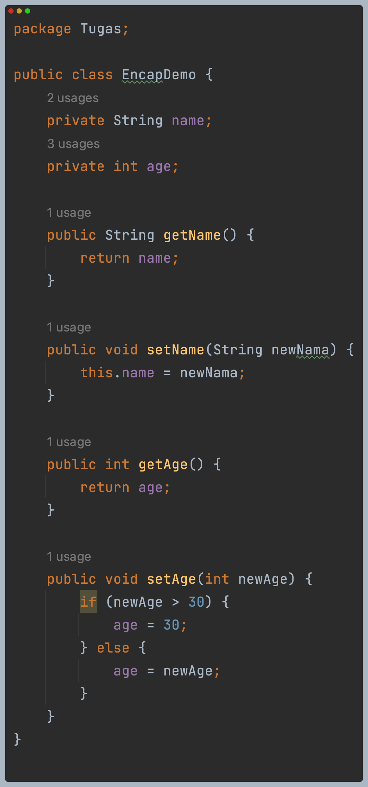

# LAPORAN JOBSHEET 3: Enkapsulasi

  
### Percobaan 1 - Enkapsulasi

Diagram class: 
 
Kode program: 
 
 
Hasil run program: 
 

  
### Percobaan 2 - Acces Modifier

Diagram class: 
 
Kode program: 
 
 
Hasil run program: 
 

#### Pertanyaan
1. Pada class TestMobil, saat kita menambah kecepatan untuk pertama kalinya, mengapa muncul peringatan “Kecepatan tidak bisa bertambah karena Mesin Off!”? 
   **Jawab**: Karena kontakOn masih bernilai false. Untuk mengganti nilai kontakOn menjadi true, maka harus menambahkan method nyalakanMesin(); terlebih dahulu.
2. Mengapat atribut kecepatan dan kontakOn diset private? 
   **Jawab**: Karena tidak perlu menambahkan lagi di class MotorDemo. Pada class Motor juga terdapat method yang bisa mengubah nilai dari attributes.
3. Ubah class Motor sehingga kecepatan maksimalnya adalah 100!
   **Jawab**: 
    
    

  
### Percobaan 3 - Setter and Getter

Diagram class: 
 
Kode program: 
 
 
Hasil run program: 

  
### Percobaan 4 - Konstruktor, Instansiasi

 
 

Kode program: 
 
 
Hasil run program: 
 

#### Pertanyaan - Percobaan 3 dan 4
1. Apa yang dimaksud getter dan setter? 
   **Jawab**: getter adalah method yang digunakan untuk mengambil nilai attribute object dan getter memiliki nilai kembalian.
   Sedangkan Setter adalah method yang digunakan untuk mengisi nilai attribute object dan tidak memiliki nilai kembalian(void).
2. Apa kegunaan dari method getSimpanan()? 
   **Jawab**: Untuk mengambil attribute simpan. 
3. Method apa yang digunakan untuk menambah saldo? 
   **Jawab**: Method setor.
4. Apa yand dimaksud konstruktor? 
   **Jawab**: method yang digunakan untuk instansiasi object.
5. Sebutkan aturan dalam membuat konstruktor? 
   **Jawab**: Nama konstruktor harus sama dengan nama class dan modifier default atau public agar dapat dieksekusi di class main.
6. Apakah boleh konstruktor bertipe private? 
   **Jawab**: Tidak, karena modifier private tidak dapat diakses oleh class lain.
7. Kapan menggunakan parameter dengan passing parameter? 
   **Jawab**: Ketika akan mengirim data atau ingin memodifikasi. 
8. Apa perbedaan atribut class dan instansiasi atribut? 
   **Jawab**: Atribut class adalah atribut yang terkait dengan class itu sendiri, bukan dengan setiap object.
   Sedangkan instansiasi atribut adalah atribut yang terkait dengan setiap object yang dibuat dari class.
9. Apa perbedaan class method dan instansiasi method? 
   **Jawab**: Class method adalah method yang terkait dengan dengan classnya sendiri, tidak terkait dengan object yang dibuat.
   Sedangkan instansiasi method adalah method yang terkait dengan object yang dibuat dari class.

  
### Tugas
1. Cobalah program dibawah ini dan tuliskan hasil outputnya 
   **Jawab**:  
   Diagram class:  
    
   Kode program:  
    
    
   Hasil run program: 
    
2. Pada program diatas, pada class EncapTest kita mengeset age dengan nilai 35, namun pada saat ditampilkan ke layar nilainya 30,
   jelaskan mengapa. 
   **Jawab**: Karena pada method setter terdapat kondisi jika newAge > 30, maka age = 30.
3. Ubah program diatas agar atribut age dapat diberi nilai maksimal 30 dan minimal 18. 
   **Jawab**:
    
4. Pada sebuah sistem informasi koperasi simpan pinjam, terdapat class Anggota yang memiliki atribut antara lain nomor KTP,
   nama, limit peminjaman, dan jumlah pinjaman. Anggota dapat meminjam uang dengan batas limit peminjaman yang ditentukan.
   Anggota juga dapat mengangsur pinjaman. Ketika Anggota tersebut mengangsur pinjaman, maka jumlah pinjaman akan berkurang
   sesuai dengan nominal yang diangsur. Buatlah class Anggota tersebut, berikan atribut, method dan konstruktor sesuai dengan kebutuhan. 
   Uji dengan TestKoperasi berikut ini untuk memeriksa apakah class Anggota yang anda buat telah sesuai dengan yang diharapkan. 
   **Jawab**: 
   Diagram class: 
    
   Kode program: 
    
    
   Hasil run: 
    
5. Modifikasi soal no. 4 agar nominal yang dapat diangsur minimal adalah 10% dari jumlah pinjaman saat ini.
   Jika mengangsur kurang dari itu, maka muncul peringatan “Maaf, angsuran harus 10% dari jumlah pinjaman”. 
   **Jawab**: 
   Kode program: 
    
   Hasil run: 
    
6. Modifikasi class TestKoperasi, agar jumlah pinjaman dan angsuran dapat menerima input dari console. 
   **Jawab**: 
   Kode program: 
    
    
