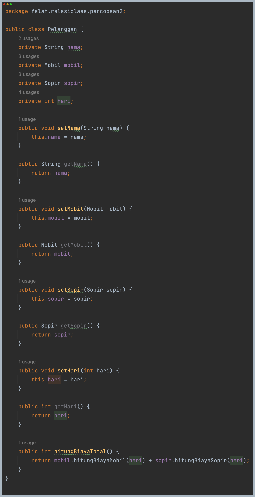
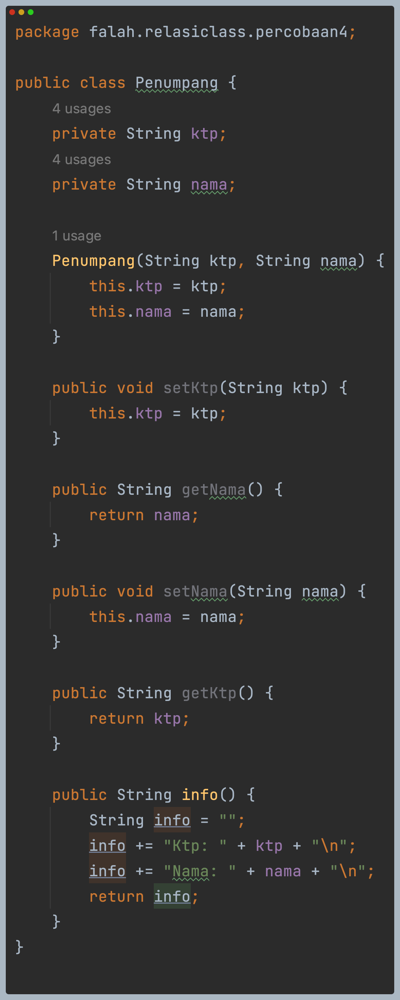
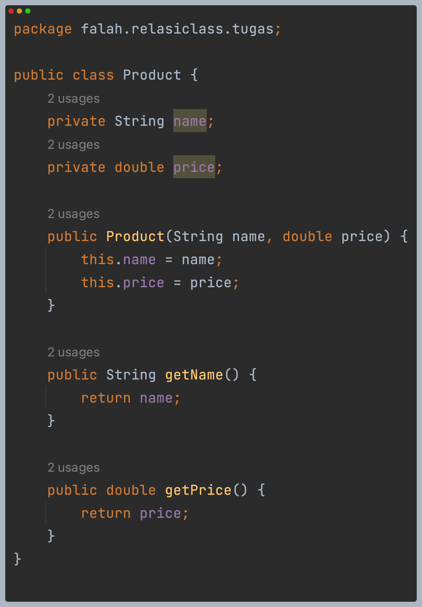

# LAPORAN JOBSHEET 4 - RELASI KELAS

## Percobaan 1
Kode program:

Hasil run program:

### Pertanyaan
1. Di dalam class Processor dan class Laptop, terdapat method setter dan getter untuk masing‐masing atributnya.
   Apakah gunanya method setter dan getter tersebut?  
   **Jawab**: Karena object sudah diinstansiasikan, setter digunakan untuk mengubah value atribut object dan 
   getter bisa digunakan untuk memanggil dan nampilkan atribut object.
2. Di dalam class Processor dan class Laptop, masing‐masing terdapat konstruktor default dan konstruktor berparameter. 
   Bagaimanakah beda penggunaan dari kedua jenis konstruktor tersebut?  
   **Jawab**: Saat menginstansiasikan default constructor, maka tidak perlu mengisi parameter di dalam tanda kurung. 
   Sedangkan untuk menginstansiakan constructor berparameter, di dalam tanda kurung harus diisikan.
3. Perhatikan class Laptop, di antara 2 atribut yang dimiliki (merk dan proc), atribut manakah yang bertipe object?  
   **Jawab**: proc.
4. Perhatikan class Laptop, pada baris manakah yang menunjukkan bahwa class Laptop memiliki relasi dengan class 
   Processor?
   **Jawab**: Saat mendeklarasikan atribut proc yang bertipe data object Processor.
5. Perhatikan pada class Laptop, Apakah guna dari sintaks proc.info()?  
   **Jawab**: Untuk memanggil dan menampilkan data processor di class Laptop.
6. Pada class MainPercobaan1, terdapat baris kode:  
   Laptop l = new Laptop("Thinkpad", p);.  
   Apakah p tersebut?  
   Dan apakah yang terjadi jika baris kode tersebut diubah menjadi:  
   Laptop l = new Laptop("Thinkpad", new Processor("Intel i5", 3));  
   Bagaimanakah hasil program saat dijalankan, apakah ada perubahan?  
   **Jawab**: p di dalam konstruktor adalah object dari class Processor yang telah diinstansiasikan.
   Jika dirubah Laptop L = new Laptop("Thinkpad", new Processor("Intel i5", 3));, tidak ada perubahan.

## Percobaan 2
Kode program:

Hasil run program:

### Pertanyaan
1. Perhatikan class Pelanggan. Pada baris program manakah yang menunjukan bahwa class Pelanggan memiliki relasi dengan 
   class Mobil dan class Sopir?  
   **Jawab**: Saat mendeklarasikan atribut mobil dan supir.
2. Perhatikan method hitungBiayaSopir pada class Sopir, serta method hitungBiayaMobil pada class Mobil. 
   Mengapa menurut Anda method tersebut harus memiliki argument hari?  
   **Jawab**: Karena menghitung biaya bergantung pada jumlah hari.
3. Perhatikan kode dari class Pelanggan. Untuk apakah perintah mobil.hitungBiayaMobil(hari) dan 
   sopir.hitungBiayaSopir(hari)?  
   **Jawab**: Agar dapat menghitung biaya mobil dan supir berdasarkan atribut hari.
4. Perhatikan class MainPercobaan2. Untuk apakah sintaks p.setMobil(m) dan p.setSopir(s)?  
   **Jawab**: Untuk menginisialisasikan atribut mobil dari pelanggan.
5. Perhatikan class MainPercobaan2. Untuk apakah proses p.hitungBiayaTotal() tersebut?  
   **Jawab**: Menjumlahkan method biaya mobil dan supir.
6. Perhatikan class MainPercobaan2, coba tambahkan pada baris terakhir dari method main
   dan amati perubahan saat di‐run!  
   System.out.println(p.getMobil().getMerk());  
   Jadi untuk apakah sintaks p.getMobil().getMerk() yang ada di dalam method main tersebut?  
   **Jawab**: Untuk menampilkan merk mobil yang berelasi object p.

## Percobaan 3
Kode program:

Hasil run program:

### Pertanyaan
1. Di dalam method info() pada class KeretaApi, baris this.masinis.info() dan this.asisten.info() digunakan untuk apa?  
   **Jawab**: Untuk memanggil data diri masinis dan asisten dari class Pegawai.
2. Buatlah main program baru dengan nama class MainPertanyaan pada package yang sama.
   Tambahkan kode berikut pada method main()!  
   Pegawai masinis = new Pegawai("1234", "Spongebob Squarepants");  
   KeretaApi keretaApi = new KeretaApi("Gaya Baru", "Bisnis", masinis);  
   System.out.println(keretaApi.info());  
   **Jawab**: 
3. Apa hasil output dari main program tersebut? Mengapa hal tersebut dapat terjadi?  
   **Jawab**: Error, karena tidak memiliki pegawai asisten.
4. Perbaiki class KeretaApi sehingga program dapat berjalan!  
   **Jawab**: 
   
   

## Percobaan 4
Kode Program:

Hasil run program:

### Pertanyaan
1. Pada main program dalam class MainPercobaan4, berapakah jumlah kursi dalam Gerbong A?  
   **Jawab**: Ada 10 kursi.
2. Perhatikan potongan kode pada method info() dalam class Kursi. Apa maksud kode tersebut?  
   ...  
   if (this.penumpang != null) {  
   &ensp;&ensp;&ensp; info += "Penumpang: " + penumpang.info() + "\n";  
   }  
   ...  
   **Jawab**: Jika kursi sudah terisi penumpang, maka akan menampilkan data penumpang.
3. Mengapa pada method setPenumpang() dalam class Gerbong, nilai nomor dikurangi dengan angka 1?  
   **Jawab**: Karena saat set nomor di class Main, memasukkan 1. Agar masuk di dalam indeks pertama array, 
   maka dikurangi 1.
4. Instansiasi objek baru budi dengan tipe Penumpang, kemudian masukkan objek baru tersebut pada gerbong dengan 
   gerbong.setPenumpang(budi, 1). Apakah yang terjadi?  
   **Jawab**: Object Penumpang p tergantikan object Penumpang budi.
5. Modifikasi program sehingga tidak diperkenankan untuk menduduki kursi yang sudah ada penumpang lain!  
   **Jawab**: 
   
   

## Tugas
Diagram class:

Kode program:

Hasil run program:
