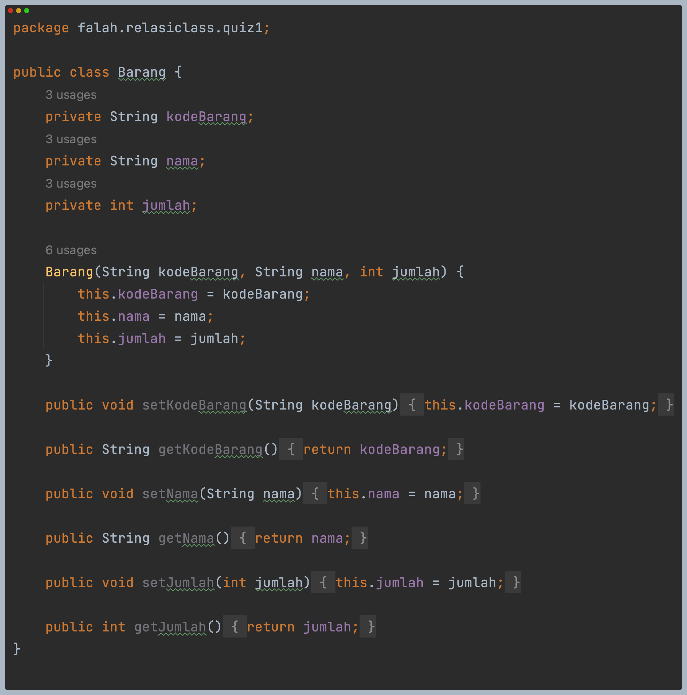
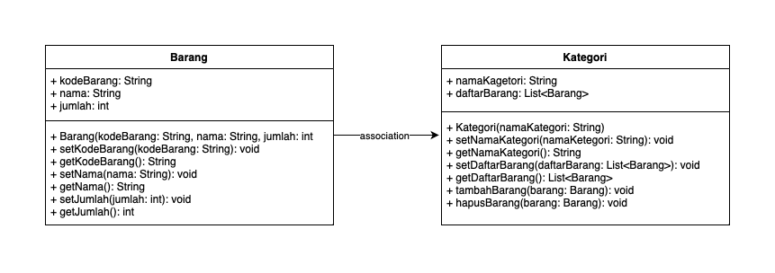

# QUIZ 1

1. Class dan Object:
   - Apa yang dimaksud dengan "class" dalam pemrograman berorientasi objek?  
   **Jawab**: class merupakan blueprint untuk membuat objek. class mendefinisikan atribut dan metode yang akan dimiliki oleh objek dari class tersebut. 
   - Bagaimana Anda mendefinisikan objek dari suatu class dalam bahasa pemrograman Java?  
   **Jawab**: NamaClass namaObject = new NamaClass();
   - Misalkan Anda memiliki class "Barang" dalam sistem informasi inventaris. Bagaimana Anda akan membuat objek "laptop" dari class tersebut?  
   **Jawab**: Barang laptop = new Barang();
  
2. Encapsulation:
   - Jelaskan konsep encapsulation dalam pemrograman berorientasi objek dan mengapa hal ini penting dalam pengembangan sistem informasi inventaris barang.  
   **Jawab**: Encapsulation merupakan konsep yang mengizinkan penyembunyian rincian-rincian implementasi dari user. Yang dimana modifier dari atribut class diatur sebagai private dan diakses melalui setters dan getters. Hal ini penting dalam pengembangan sistem informasi inventaris barang karena melindungi data dari modifikasi yang tidak sah dan memastikan validasi data sebelum diakses atau diubah.
   - Dalam konteks sistem informasi inventaris, sebutkan contoh atribut (variabel) yang harus di-encapsulate dan mengapa.  
   **Jawab**: nama, jumlah, harga. Untuk memastikan integritas data dan validasi nilai-nilai tersebut sebelum diakses atau dimodifikasi.
  
3. Relasi Kelas:
   - Apa yang dimaksud dengan relasi antara kelas dalam pemrograman berorientasi objek?  
   **Jawab**: Relasi antara kelas merupakan bagaimana cara kelas-kelas saling berhubungan atau bekerjasama dalam suatu sistem. Ini bisa berupa hubungan inheritance, association, composition, atau aggregation.
   - Dalam sistem informasi inventaris barang, bagaimana Anda akan menggambarkan relasi antara kelas "Barang" dan kelas "Kategori"?  
   **Jawab**: Setiap objek 'Barang' dapat memiliki referensi ke objek 'Kategori' yang menunjukkan kategori barang tersebut.
  
4. PBL:
   - Berdasarkan kasus sistem informasi inventaris barang, coba buat sebuah class sederhana beserta atribut dan metodenya yang menggambarkan suatu entitas dalam sistem tersebut (misalnya, class "Barang").  
   **Jawab**:  
   
   - Bagaimana Anda akan menggunakan encapsulation untuk melindungi atribut-atribut dalam class tersebut?  
   **Jawab**: Modifier dari atribut dibuat private lalu membuat konstruktor berparameter dan membuat setters dan getters
   - Gambarkan hierarki class atau hubungan antar class yang mungkin ada dalam sistem informasi inventaris barang di jurusan Teknologi Informasi. Berikan contoh relasi antar class (misalnya, inheritance atau association) dalam konteks tersebut.  
   **Jawab**:  
   