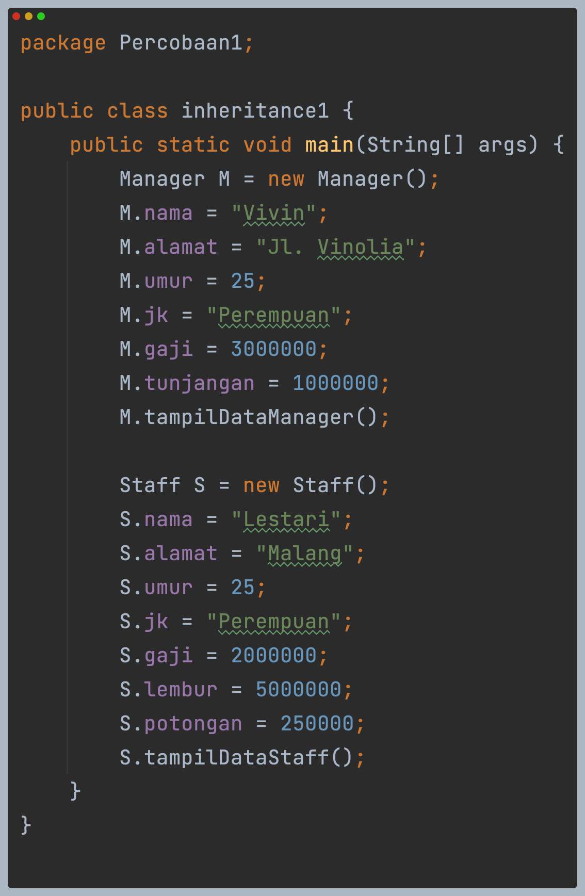

# JOBSHEET 6 - INHERITANCE

## Percobaan 1
Kode program:  

Hasil run program:  

### Pertanyaan
1. Sebutkan class mana yang termasuk super class dan sub class dari percobaan 1 diatas!  
    **Jawab**: super class dari kode program tersebut adalah class Karyawan. Lalu subclass dari Karyawan adalah Manager dan Staff.
2. Kata kunci apakah yang digunakan untuk menurunkan suatu class ke class yang lain?  
    **Jawab**: extends digunakan untuk membuat subclass, super.attribute digunakan untuk memanggil attribute dari superclass, super() digunakan untuk memanggil parameter dari constructor superclass, dan super.method digunakan untuk memanggil method superclass.
3. Perhatikan kode program pada class Manager, atribut apa saja yang dimiliki oleh class
   tersebut? Sebutkan atribut mana saja yang diwarisi dari class Karyawan!  
    **Jawab**: Attribute yang dimiliki adalah tujungan. Sedangkan yang diwarisi dari class Karyawan adalah nama, alamat, jk, umur, dan gaji.
4. Jelaskan kata kunci super pada potongan program dibawah ini yang terdapat pada class
   Manager!  
    **Jawab**: Keyword super digunakan untuk memanggil attribute gaji dari class Karyawan.
5. Program pada percobaan 1 diatas termasuk dalam jenis inheritance apa? Jelaskan
   alasannya!  
    **Jawab**: Single Inheritance.

## Percobaan 2
Kode program:  

Hasil run program:  

### Pertanyaan
1. Berdasarkan class diatas manakah yang termasuk single inheritance dan mana yang termasuk multilevel inheritance?  
    **Jawab**: Yang termasuk single inheritance adalah superclass Karyawan yang memiliki subclass Manager. Yang termasuk multilevel adalah superclass Karyawan yang memiliki subclass Staff dan class Staff adalah superclass dari subclass StaffTetap dan StaffHarian.
2. Perhatikan kode program class StaffTetap dan StaffHarian, atribut apa saja yang dimiliki oleh class tersebut? Sebutkan atribut mana saja yang diwarisi dari class Staff!  
    **Jawab**:   
    - Attribute dari class StaffTetap adalah golongan dan asuransi. 
    - Attribute dari class StaffHarian adalah jmlJamKerja.
    - Attribute yang diwarisi dari class Staff adalah nama, alaamt, jk, umur, gaji, lembur, potongan.
3. Apakah fungsi potongan program berikut pada class StaffHarian  
   super(nama, alamat, jk, umur, gaji, lembur, potongan);  
    **Jawab**: Fungsi dari potongan program tersebut untuk memanggil constructor dan parameter dari class Staff.
4. Apakah fungsi potongan program berikut pada class StaffHarian  
   super.tampilDataStaff();  
    **Jawab**: Fungsi dari potongan program tersebut untuk memanggil method dari class Staff
5. Perhatikan kode program dibawah ini yang terdapat pada class StaffTetap  
   System.out.println("Gaji Bersih       = " + (gaji + lembur - potongan - asuransi));  
   Terlihat dipotongan program diatas atribut gaji, lembur dan potongan dapat diakses langsung. Kenapa hal ini bisa terjadi dan bagaimana class StaffTetap memiliki atribut gaji, lembur, dan potongan padahal dalam class tersebut tidak dideklarasikan atribut gaji, lembur, dan potongan?  
    **Jawab**: Karena dalam constructor StaffTetap sudah memanggil super() yang berisi parameter dari constructor class Staff.

## Tugas
Kode program:  
 

Hasil run program:  

