# JOBSHEET 9 OVERLOADING DAN OVERRIDING

## Praktikum
### Class Karyawan:  
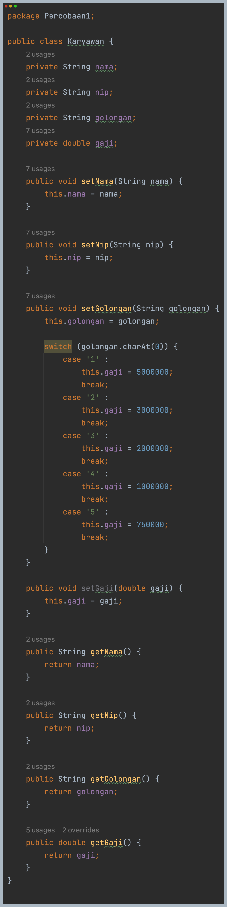

### Class Staff:  
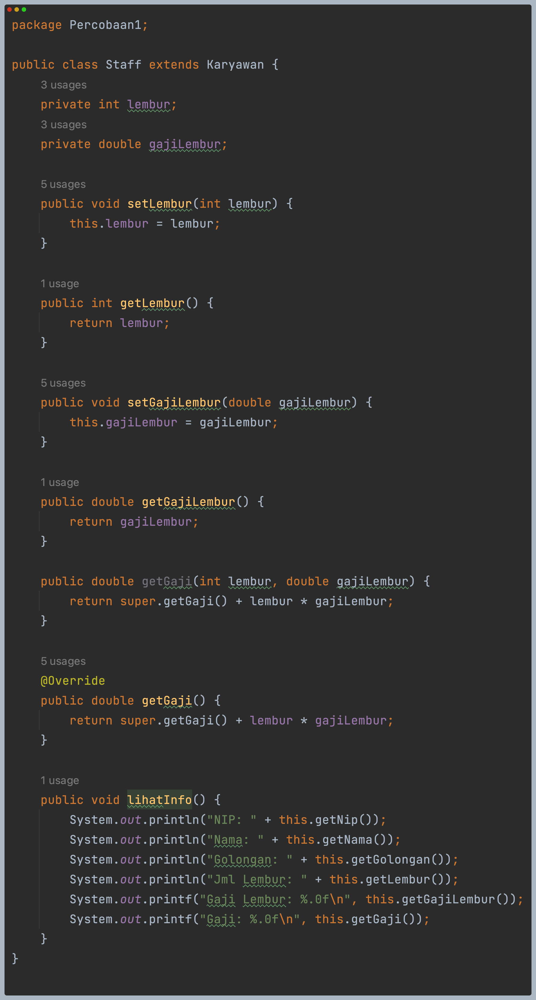

### Class Manager:  
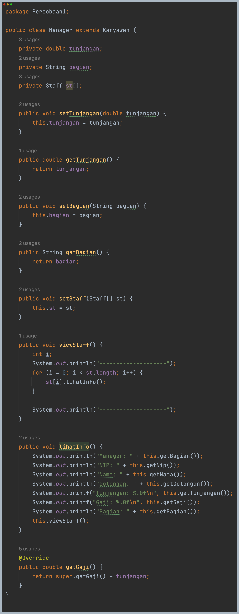

### Class Utama:  
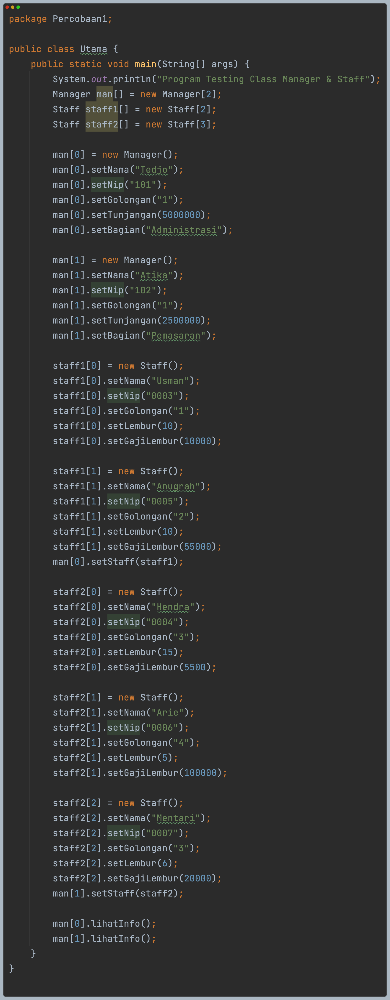

### Hasil Run Program:  
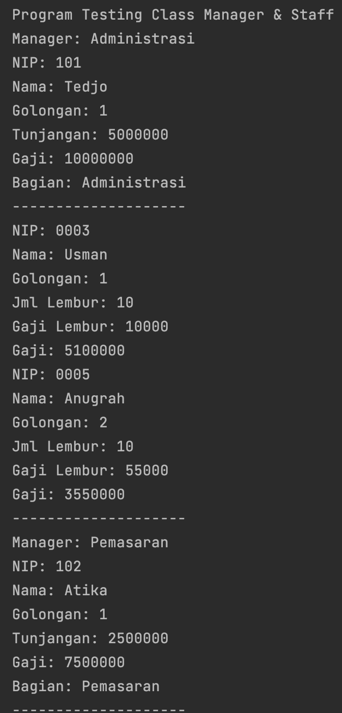
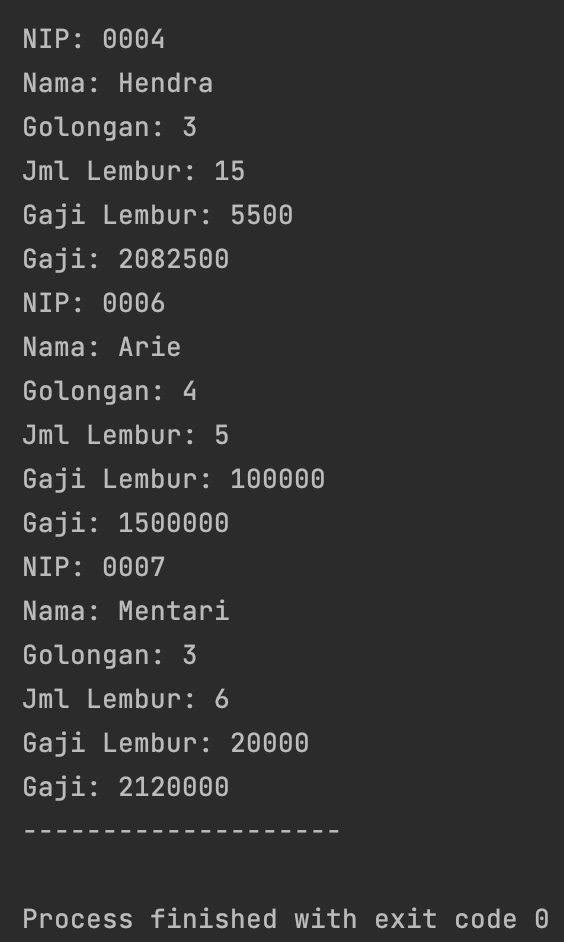

## Latihan
1. Dari source coding diatas terletak dimanakah overloading?  
   **Jawab**: Terletak pada method perkalian(int a, int b, int c)
2. Jika terdapat overloading ada berapa jumlah parameter yang berbeda?  
   **Jawab**: Terdapat 1 parameter yang berbeda, yaitu parameter c.
3. Dari source coding diatas terletak dimanakah overloading?  
   **Jawab**: Terletak pada method perkalian(double a, double b)
4. Jika terdapat overloading ada berapa tipe parameter yang berbeda?  
   **Jawab**: Terdapat 2 tipe paramater yang berbeda, yaitu double a, double b.
5. Dari source coding diatas terletak dimanakah overriding?  
   **Jawab**: Terletak pada class Piranha.
6. Jabarkanlah apabila sourcoding diatas jika terdapat overriding?  
   **Jawab**: Pada superclass Ikan memiliki method swim(), lalu pada subclass Piranha juga terdapat method swim() yang diambil dari superclass 

## Tugas
### Overloading
Kode Program:  
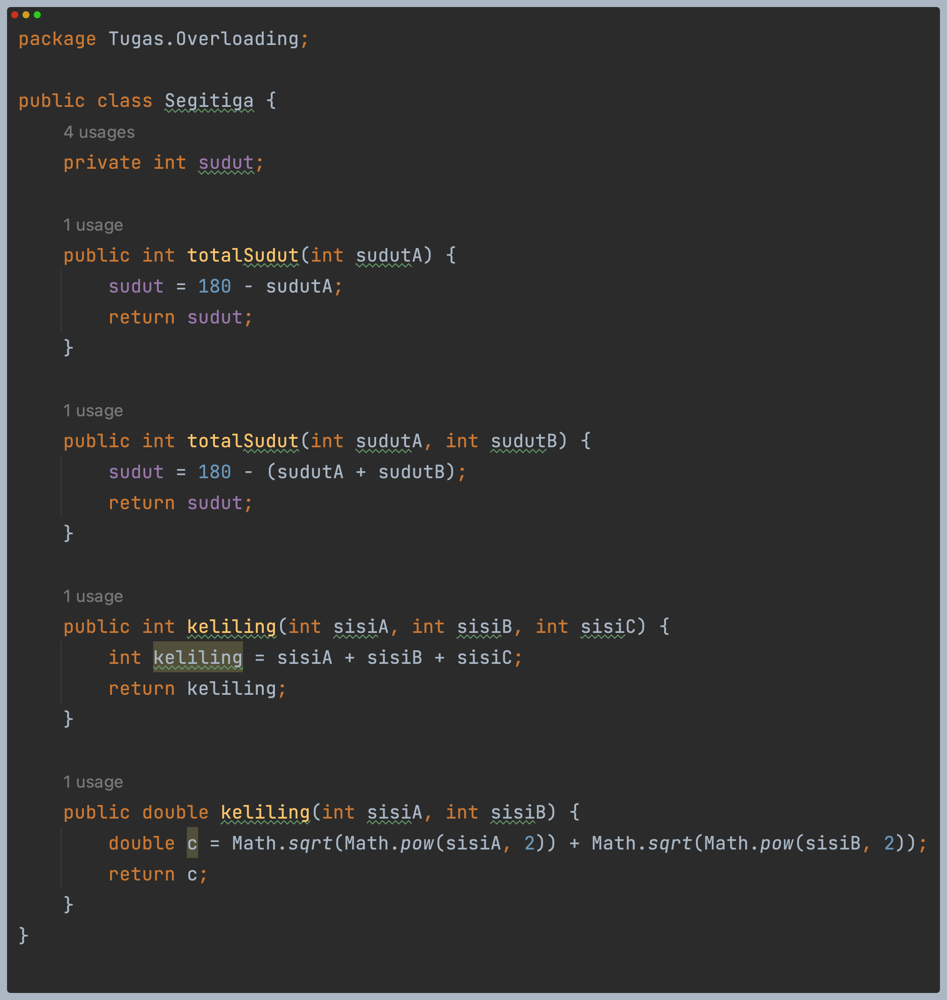
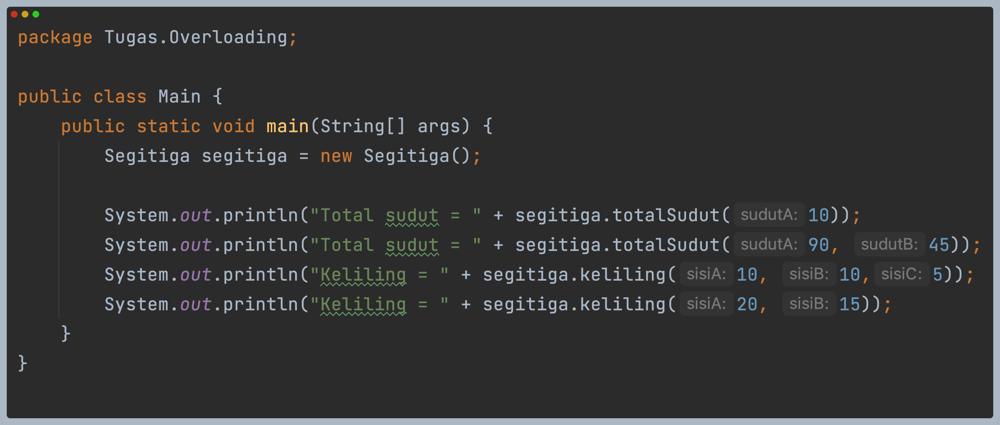

Hasil Run Program:  
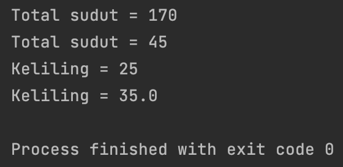

### Overriding
Kode Program:  
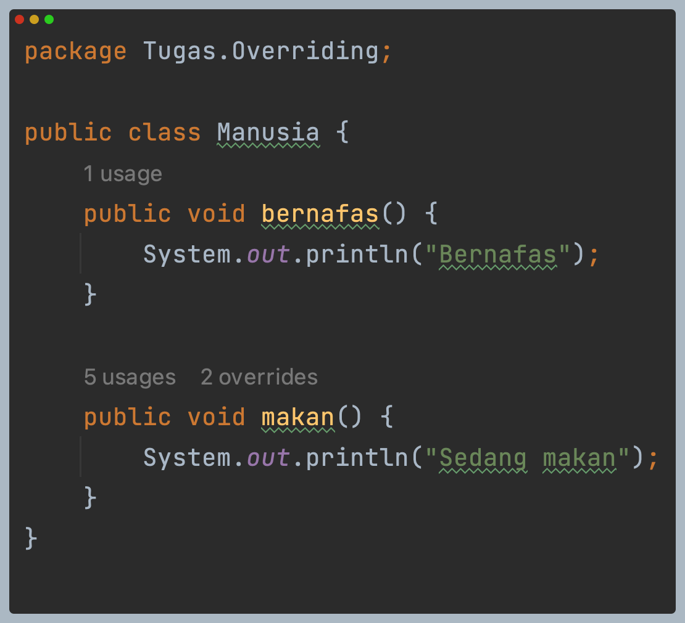
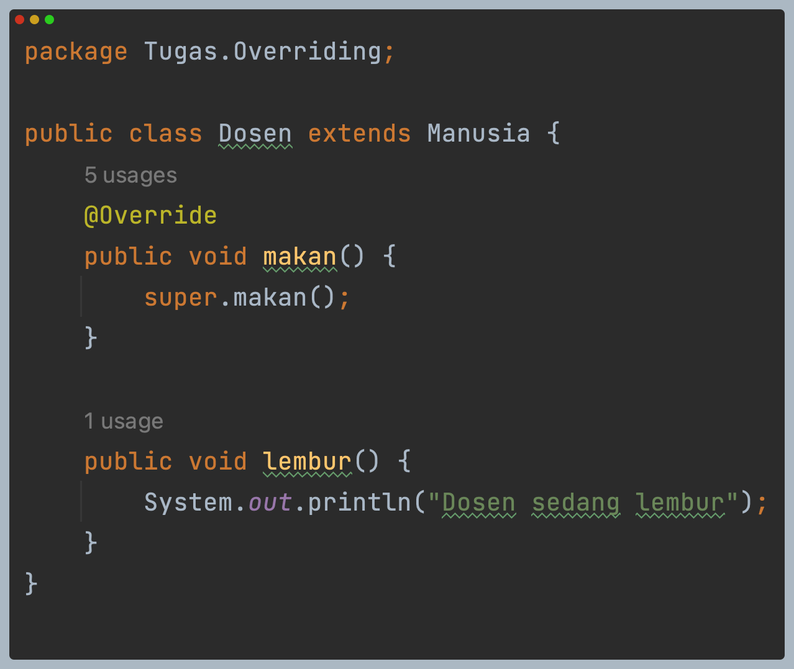
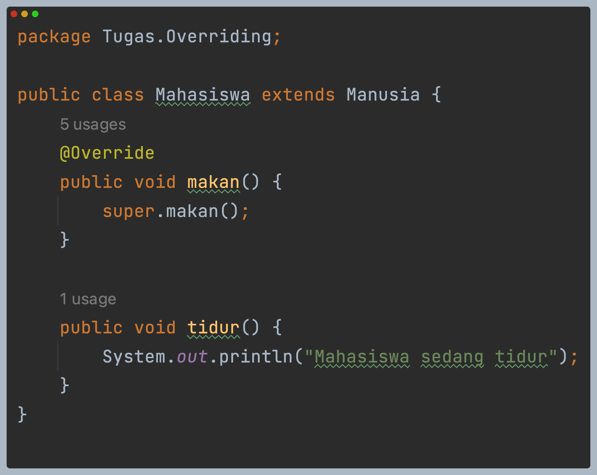
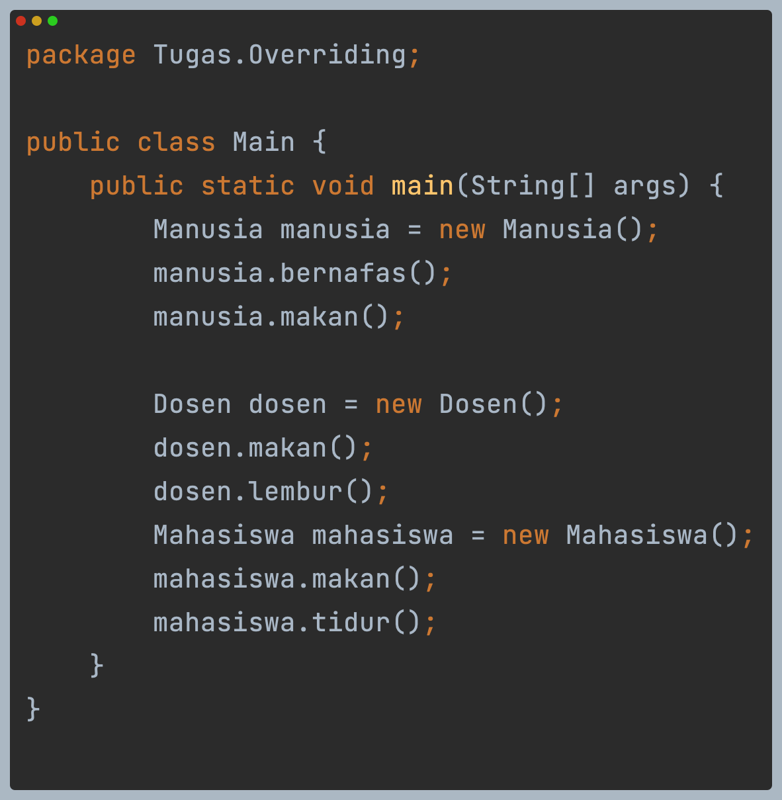

Hasil Run Program:  
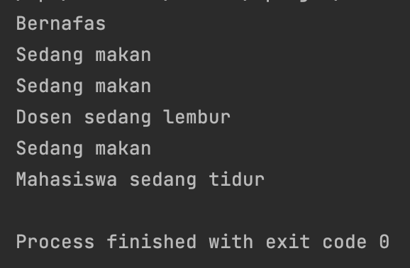