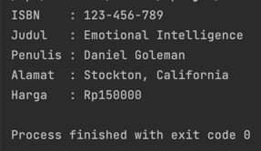

# UTS OOP

### Soal 1: Penulisan Class
Berdasarkan contoh class ClassA di bawah ini, jelaskan apakah penulisan source code pada contoh
class tersebut sudah benar. Jika tidak, apa yang perlu diperbaiki?
    
    public class ClassA {
        float f1 = 0.15f;
        
        float hitung() {
            float x = 2f * f1;
        }
    }

**Jawab**: Tidak, perlu menambahkan nilai return pada method hitung().

### Soal 2: Perhitungan Jumlah Elemen Array 2 Dimensi
Pada class Soal2.SoalArray1, terdapat array 2 dimensi dengan ukuran 3x3. Tuliskan code Java untuk
menghitung jumlah total elemen array tersebut dengan menggunakan perulangan.

    public class Soal2.SoalArray1 {
        public static void main(String[] args) {
            int[][] arrayInt = {{1, 1, 4}, {2, 1, 2}, {3, 2, 1}};
            // hitung jumlah elemen array 2 dimensi
            // gunakan perulangan
        }
    }

**Jawab**:  
Kode program:  

Hasil run program:  

### Soal 3: Pewarisan Atribut dan Method
Pada source code yang diberikan, class ClassY merupakan turunan dari class Class. Sebutkan atribut
dan method apa saja yang diwarisi oleh ClassY dari kelas induknya (class Class). Jelaskan juga apa
output dari code yang ditulis pada class ClassY dan bagaimana nilai tersebut diperoleh.

    public class Class {
        int a = 2;
        int x = 0;

        int hitung() {
            x = x + 5 * a;
            return x;
        }
    }

    public class ClassY extends Class {
        int b = 5;
        int y = 0;

        int hitungY() {
            y = hitung() * b;
            return y;
        }

        public static void main(String[] args) {
            ClassY cy = new ClassY();
            System.out.println(cy.hitungY());
        }
    }

**Jawab**: ClassY diwarisi atribut a dan x dan method hitung() dari superclass. 
Atribut a dan x didapatkan dari method hitung().  

Hasil run program:  
  

Penjelasan:
- Pada method main, membuat objek cy dari class ClassY.
- Memanggil method hitungY().
- pada method hitungY() terdapat method hitung() dari class Class. Method hitung() diproses terlebih
  dahulu.
- Hasil dari method hitung() lalu diproses dengan dikalikan atribut b pada method hitungY().

### Soal 4: Class Mahasiswa dengan Constructor
Dalam class Mahasiswa, lengkapi code dengan:  
a. Menambahkan constructor untuk mengisi atribut nim, nama, alamat, dan jenisKelamin.  
b. Membuat objek mahasiswa dan mengisi atribut nim, nama, alamat, dan jenisKelamin melalui
constructor.

    public class Mahasiswa {
        String nim, nama, alamat;
        char jenisKelamin;
    
        // a. Tambahkan constructor
        // Gunakan constructor untuk
        // mengisi atribut nim, nama, alamat, jenisKelamin

        public static void main(String[] args) {
            // b. Buat objek mahasiswa
            // Isi atribut nim, nama, alamat, jenisKelamin
            // lewat constructor
        }
    }

**Jawab**:  
Kode program:  

Hasil run program:  

### Soal 5: OOP Buku -> Penulis
Perhatikan class diagaram berikut dan Buatlah Source code dalam Bahasa java berdasarkan class
diagram tersebut  

**Jawab**:  
Kode program:  

Hasil run program:  
