# JOBSHEET 12 - Polymoprism

### Percobaan 1 - Bentuk dasar polimorfisme
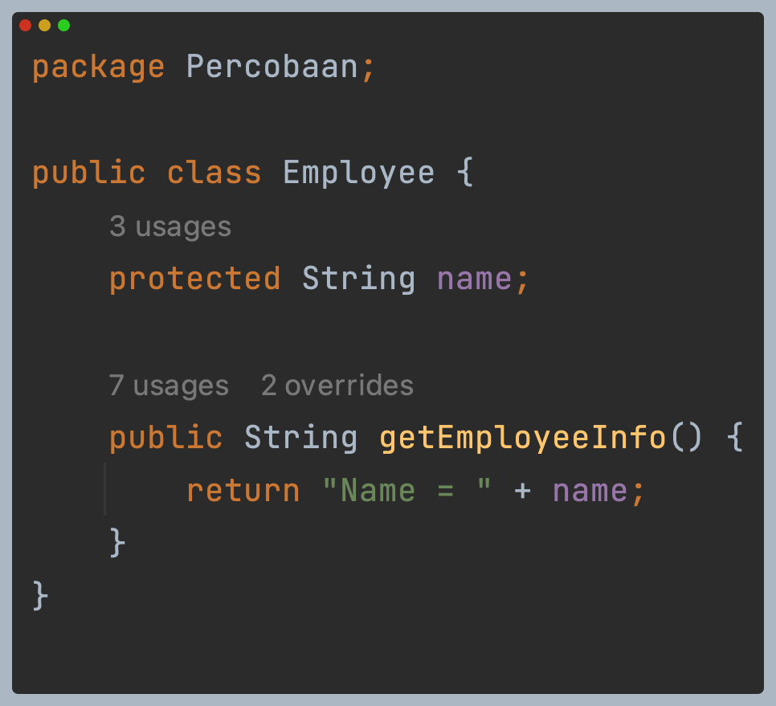

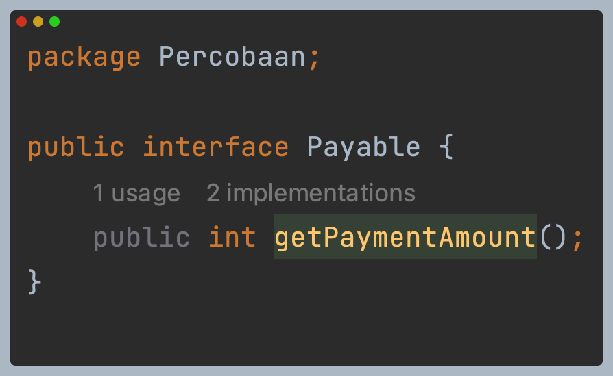

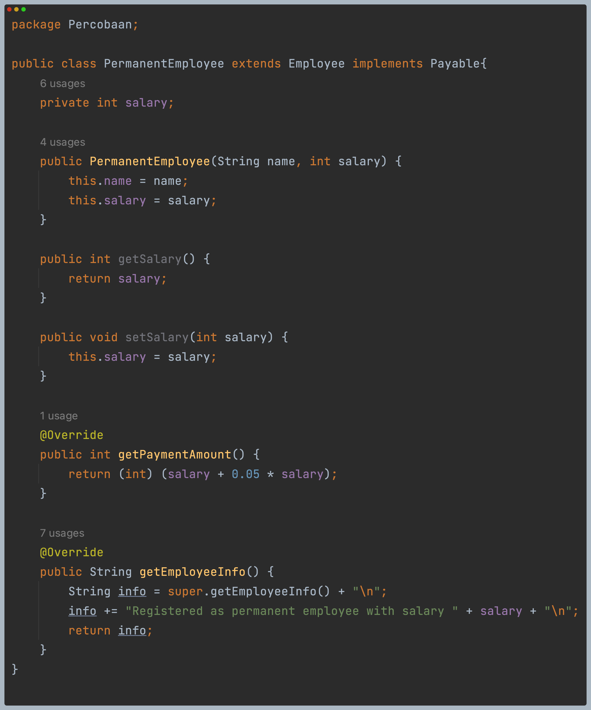

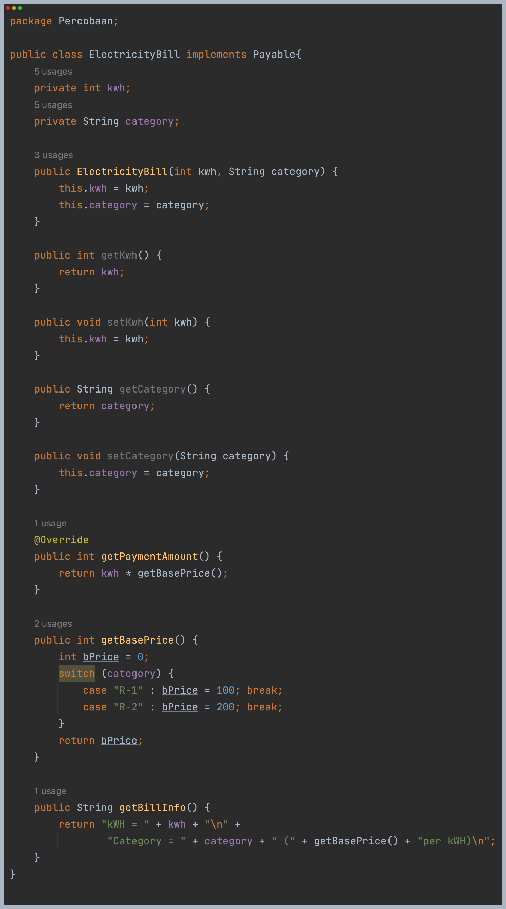

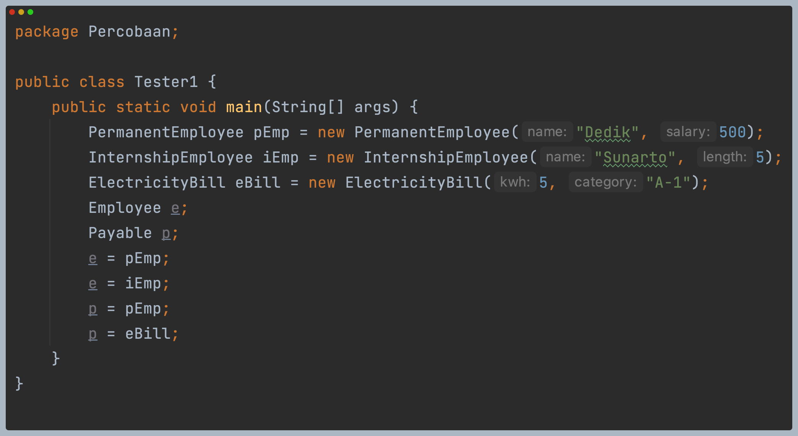

#### Pertanyaan
1. Class apa sajakah yang merupakan turunan dari class Employee?  
   **Jawab**: class InternshipEmployee dan class PermanentEmployee.  
    
2. Class apa sajakah yang implements ke interface Payable?  
   **Jawab**: class PermanentEmployee dan class ElectricityBill.  
    
3. Perhatikan class Tester1, baris ke-10 dan 11. Mengapa e, bisa diisi
   dengan objek pEmp (merupakan objek dari class PermanentEmployee) dan objek iEmp (merupakan objek dari class
   InternshipEmploye) ?  
   **Jawab**: Karena objek dari class InternshipEmployee dan class PermanentEmployee merupakan turunan class 
   dari class Employee.  
    
4. Perhatikan class Tester1, baris ke-12 dan 13. Mengapa p, bisa diisi denganobjekpEmp (merupakan objek dari
   class PermanentEmployee) dan objek eBill (merupakan objek dari class ElectricityBill) ?  
   **Jawab**: Karena keduanya mengimplementasi interface Payable.  
    
5. Coba tambahkan sintaks:  
   p = iEmp;  
   e = eBill;  
   pada baris 14 dan 15 (baris terakhir dalam method main) ! Apa yang menyebabkan error?  
   **Jawab**: Karena iEmp tidak mengimplementasikan interface payable dan eBill bukan class turunan dari class
   Employee.  
    
6. Ambil kesimpulan tentang konsep/bentuk dasar polimorfisme!  
   **Jawab**: 
   - Polimorfisme memungkinkan objek dari class turunan dapat diakses melalui variabel dengan tipe class induknya.
   - Interface dapat digunakan sebagai tipe data untuk menciptakan polimorfisme antara objek yang mengimplementasi 
     interface tersebut.
   - Polimorfisme memungkinkan fleksibilitas dalam menggunakan objek, terutama dalam konteks pewarisan dan 
     implementasi interface.  
    

### Percobaan 2 -  Virtual method invocation
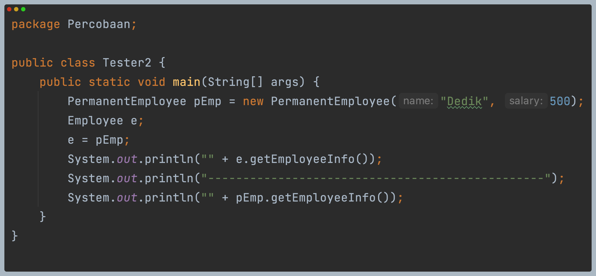

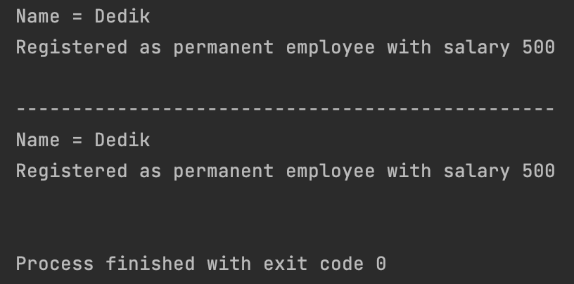

#### Pertanyaan
1. Perhatikan class Tester2 di atas, mengapa pemanggilan e.getEmployeeInfo() pada baris 8 dan pEmp.getEmployeeInfo()
   pada baris 10 menghasilkan hasil sama?  
   **Jawab**: Karena 'e' merupakan referensi objek dari class PermanentEmployee (pEmp). Meskipun tipe variabel 'e' 
   dideklarasikan sebagai class Employee, tetapi pada saat runtime, objek yang sebenarnya diakses adalah objek dari 
   class PermanentEmployee.  
    
2. Mengapa pemanggilan method e.getEmployeeInfo() disebut sebagai pemanggilan method virtual (virtual method 
   invication), sedangkan pEmp.getEmployeeInfo() tidak?  
   **Jawab**: Karena method tersebut dipanggil melalui referensi variabel dengan tipe class induk (Employee).  
    
3. Jadi apakah yang dimaksud dari virtual method invocation? Mengapa disebut virtual?  
   **Jawab**: Virtual method invocation merujuk pada pemanggilan method pada saat runtime, di mana pemilihan 
   implementasi method tergantung pada tipe objek yang sebenarnya saat runtime.   
    

### Percobaan 3 - Heterogenous Collection
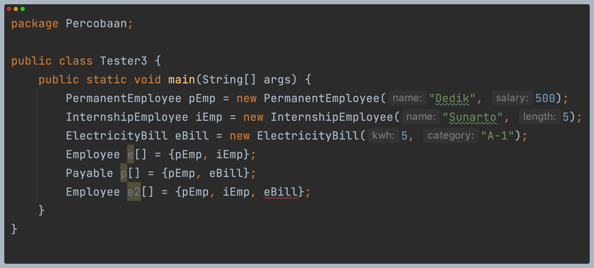

#### Pertanyaan
1. Perhatikan array e pada baris ke-8, mengapa ia bisa diisi dengan objek-objek dengan tipe yang berbeda, 
   yaitu objek pEmp (objek dari PermanentEmployee) dan objek iEmp (objek dari InternshipEmployee) ?  
   **Jawab**: Karena keduanya adalah turunan dari class Employee.  
    
2. Perhatikan juga baris ke-9, mengapa array p juga biisi dengan objek-objek dengan tipe yang berbeda, 
   yaitu objek pEmp (objek dari PermanentEmployee) dan objek eBill (objek dari ElectricityBilling) ?  
   **Jawab**: Karena keduanya mengimplementasi interface Payable.  
    
3. Perhatikan baris ke-10, mengapa terjadi error?  
   **Jawab**: Karena eBill bukan class turunan dari class Employee.  
    

### Percobaan 4 - Argumen polimorfisme, instanceof dan casting objek
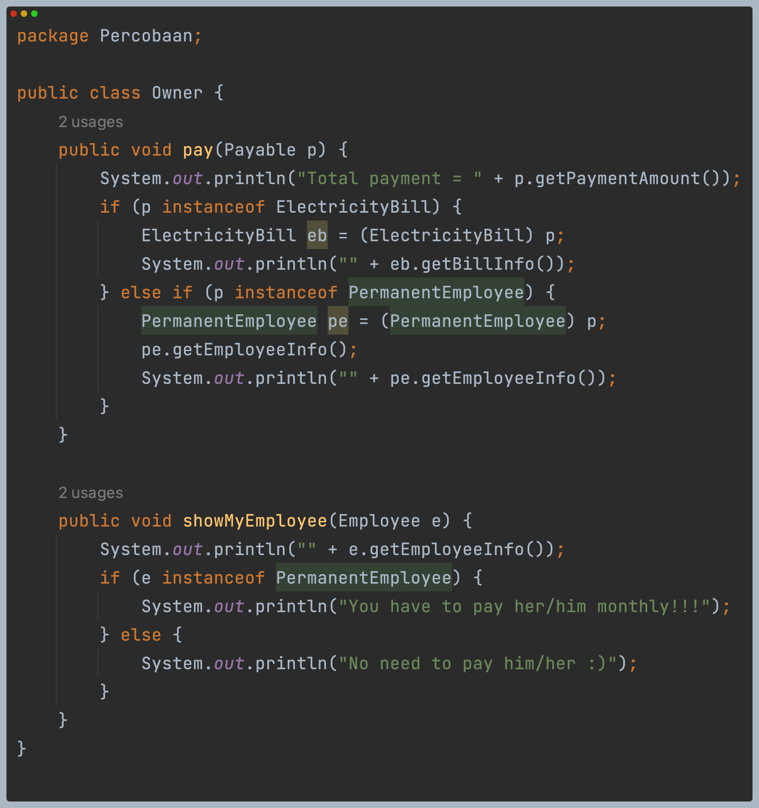

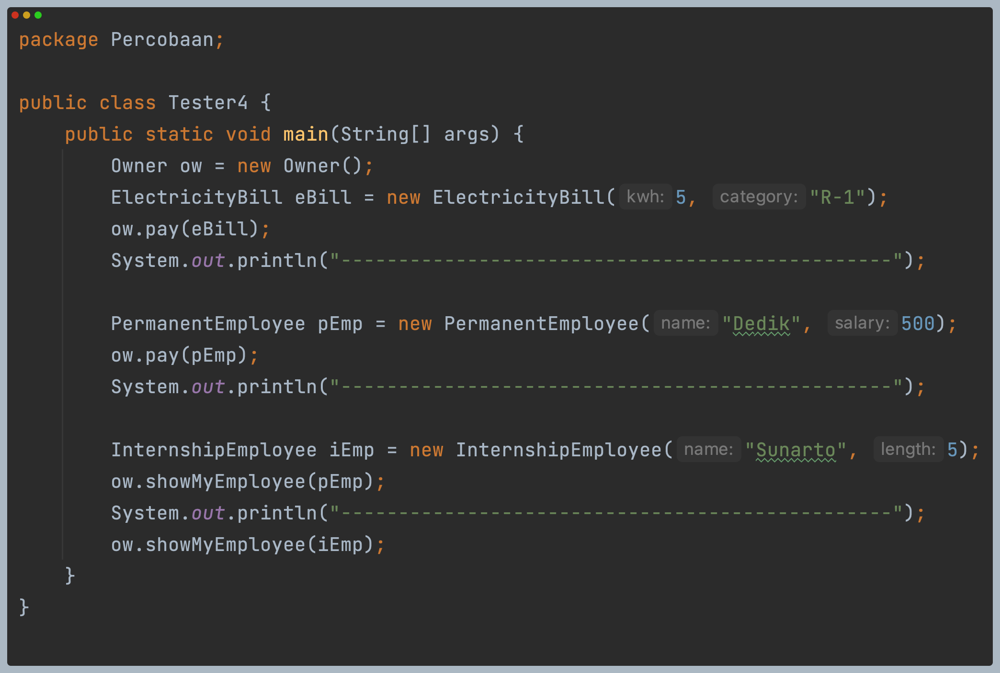

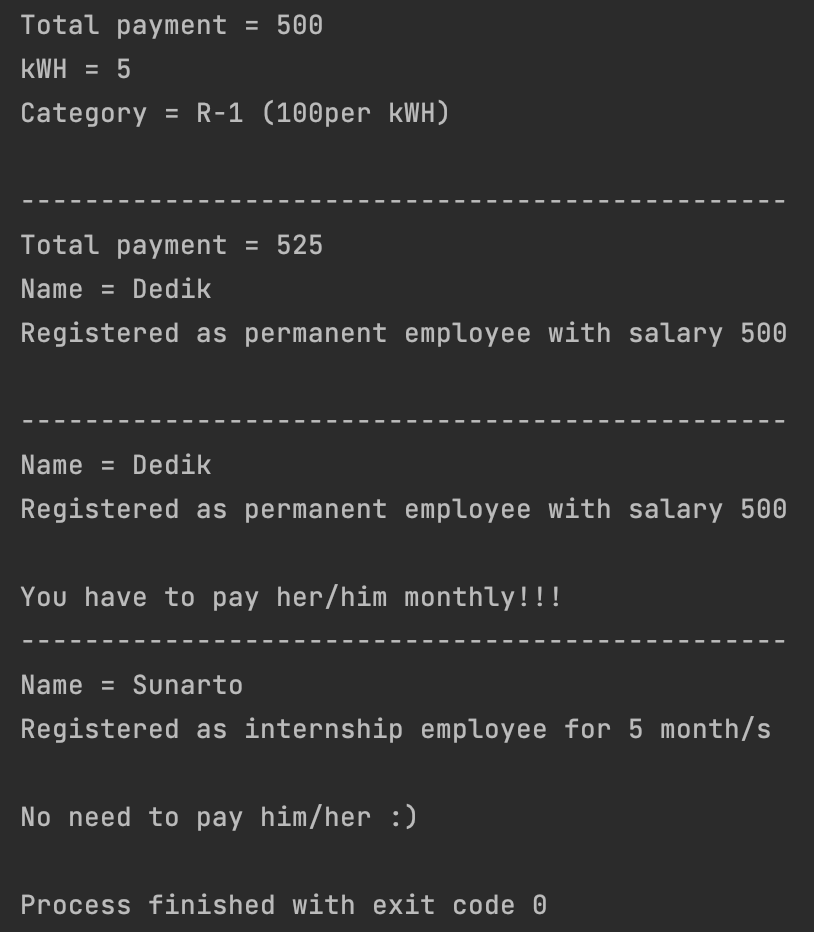

#### Pertanyaan
1. Perhatikan class Tester4 baris ke-7 dan baris ke-11, mengapa pemanggilan ow.pay(eBill) dan ow.pay(pEmp) 
   bisa dilakukan, padahal jika diperhatikan method pay() yang ada di dalam class Owner memiliki argument/parameter 
   bertipe Payable?  
   Jika diperhatikan lebih detil eBill merupakan objek dari ElectricityBill dan pEmp merupakan objek dari 
   PermanentEmployee?  
   **Jawab**: Karena objek dari class ElectricityBill dan objek dari class PermanentEmployee keduanya mengimplementasi 
   interface Payable.  
    
2. Jadi apakah tujuan membuat argument bertipe Payable pada method pay() yang ada di dalam class Owner?  
   **Jawab**: Untuk memberikan fleksibilitas. Dengan menggunakan tipe data interface Payable sebagai parameter, 
   method pay() dapat menerima objek dari berbagai class yang mengimplementasi interface Payable.  
    
3. Coba pada baris terakhir method main() yang ada di dalam class Tester4 ditambahkan perintah ow.pay(iEmp);  
   Mengapa terjadi error?  
   **Jawab**: Hal ini karena class InternshipEmployee bukan class yang mengimplementasi interface Payable.  
    
4. Perhatikan class Owner, diperlukan untuk apakah sintaks p instanceof ElectricityBill pada baris ke-6 ?  
   **Jawab**: Digunakan untuk memeriksa apakah objek yang diterima sebagai parameter (p) merupakan instance dari 
   class ElectricityBill atau turunannya.  
    
5. Perhatikan kembali class Owner baris ke-7, untuk apakah casting objek disana 
   (ElectricityBill eb = (ElectricityBill) p) diperlukan ? Mengapa objek p yang bertipe Payable harus di-casting ke
   dalam objek eb yang bertipe ElectricityBill ?  
   **Jawab**: Casting objek (ElectricityBill) p diperlukan karena pada saat kompilasi, variabel p diperlakukan sebagai 
   tipe Payable. Ini dilakukan untuk memberitahu compiler bahwa objek p sebenarnya adalah objek dari 
   class ElectricityBill, sehingga dapat diakses metode dan properti yang ada dalam class tersebut.  
    

### Tugas
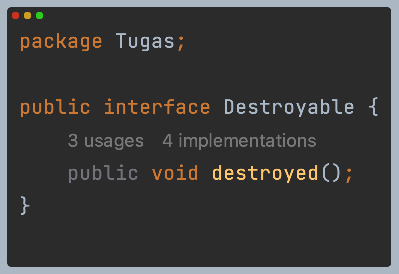

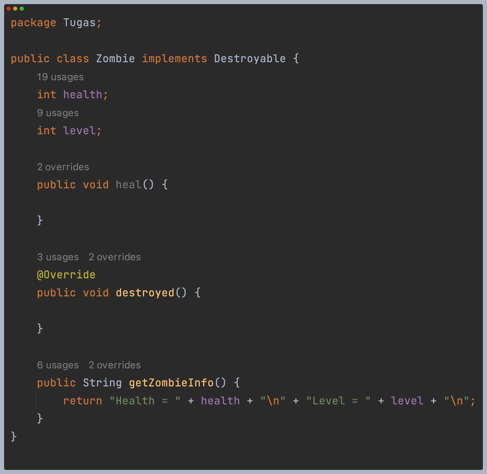

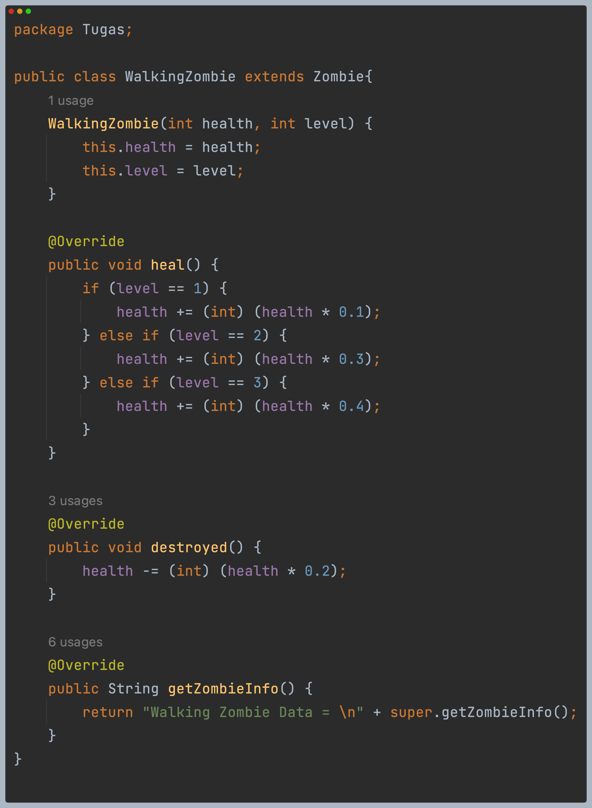

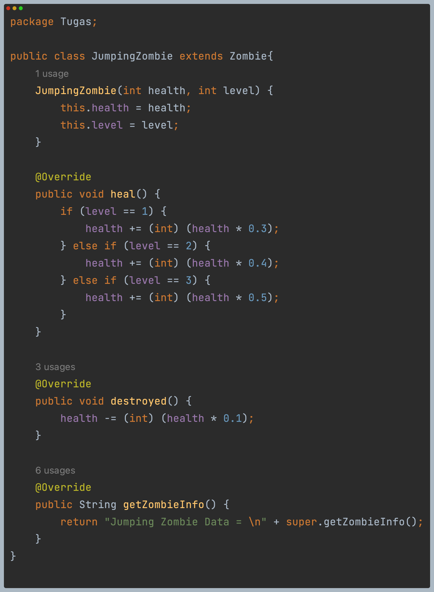

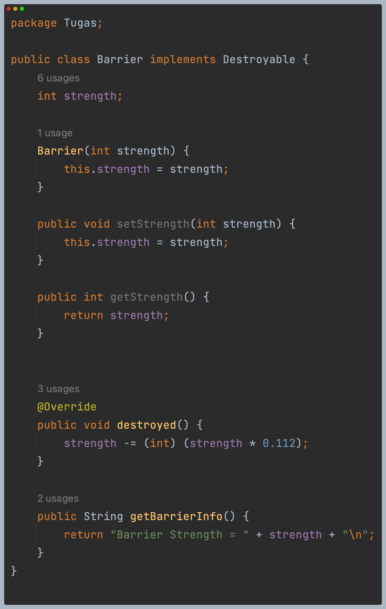

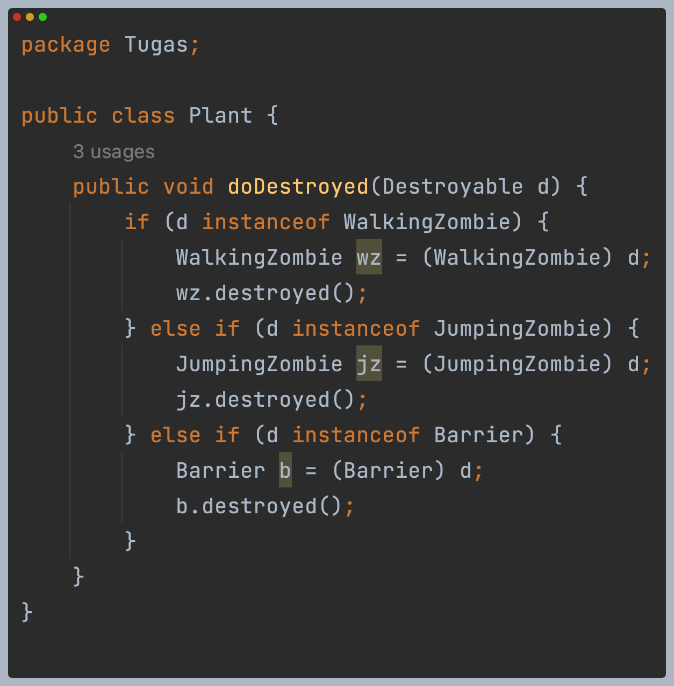

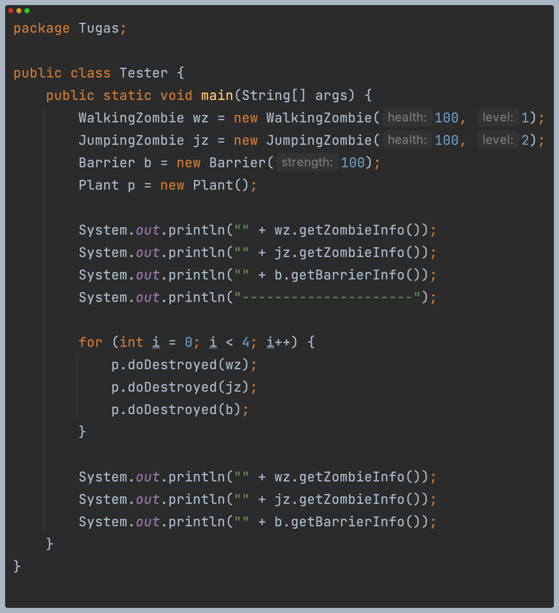

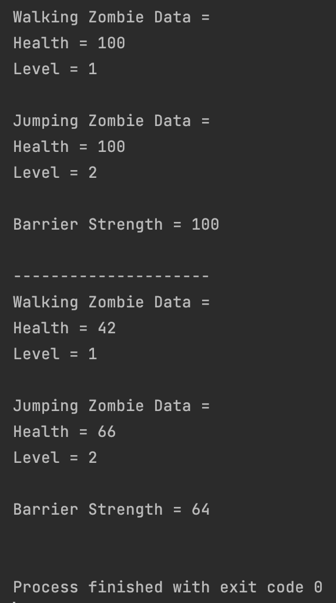